step 1

download the "ip only download" for the DPUCZDX8G. untar this into your scratch workspace

step 2

Launch Vivado, and create a new project in your scratch directory. Set it up for the KR260 and set up the necessary connections

step 3

We need to add the IP for the DPU. Launch the settings, go to IP, then Repository.

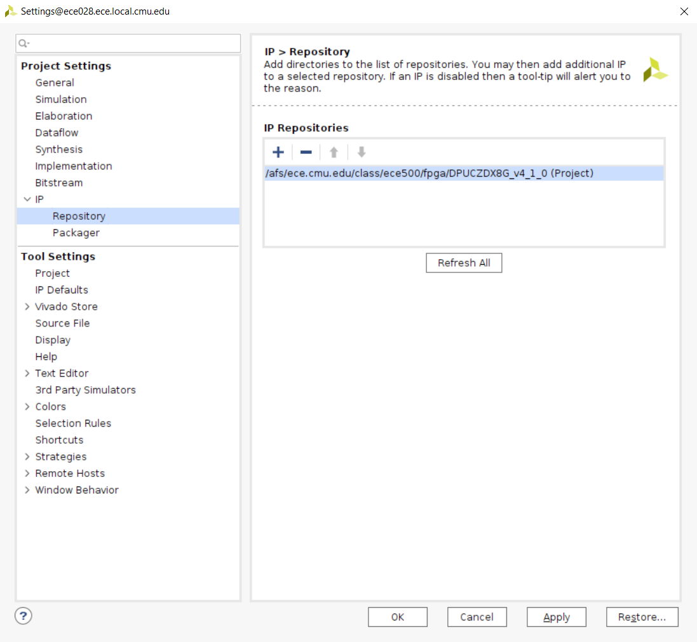

step 4

Open up the block diagram editor. Add the Zynq MPSoC. Head over to its PS-PL interfaces. Enable one of the low power master interfaces.

We plan on using a few of the slave interfaces, but for the time being we'll configure this later. This will depend on the number of DPU cores we actually want to instantiate.

Head over to the clock config, into the PL fabric clocks. Enable a second clock and lets set it to 275 MHz. Note that the actual PLL freq will be different. We'll use this clock for the slave interfaces from the DPU.

Next step, is we're going to create the clock tree for the non-dpu stuff, this is the same thing that we did in the regular platform tutorial.

Create a clock wizard with three outputs at 100, 200, and 400. Make sure to set the reset type to active low. 

Let's go ahead and add the reset peripherals, an axi interconnect, and an axi interrupt controller. 

Configure the axi interconnect to have two masters interfaces. This way we can use the low power interface to talk to the DPU and to handle the interrupt request. 

Connect up ACLK (crossbar clock), S00_ACLK, M00_ACLK to the 100Mhz from the clocking wizard. Connect up the clock for M01_ACLK to the 100MHz from the MPSoC. Connect the resets up appropriately. 


Create a hierarchy, call it hier_dpu

Add in the DPU ip block. Set the number of DPU cores to 2, and the arch to B512 (feel free to change this later, but you'll have to make sure your model is appropriately compiled for this architecture down the line)

This is a good starting point for settings, feel free to change things as necessary:
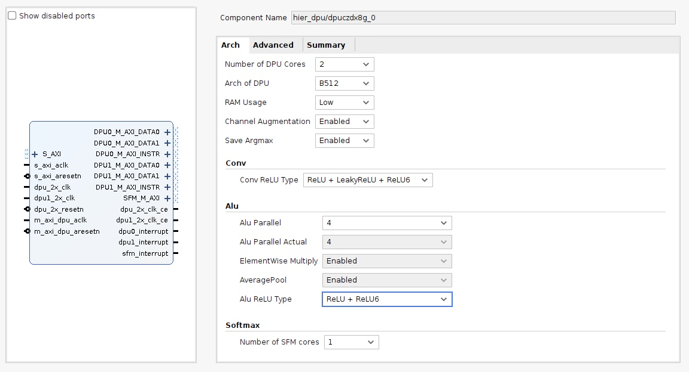
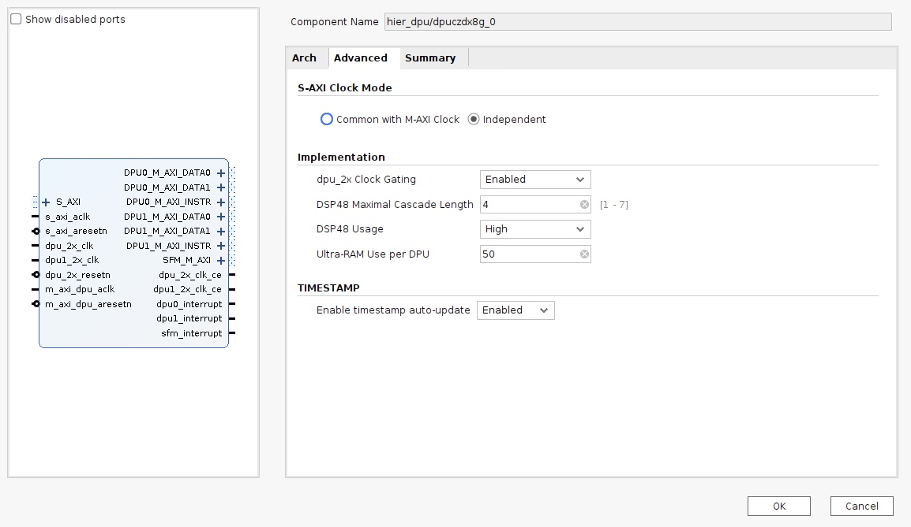

for the dpu_2x clock gating feature we enabled earlier, we need to enable the CE (clock enable) ports on our clocking wizard for the two DSP clocks. A few other things, in the clocking options tab make sure the type is set to auto. In the output clocks tab, make sure that we enable the optional input reset pin, and that the reset polarity is active low.

We also need to ensure that the 275 clock and 550 clocks are phase aligned, so to aid with that, we enable the matched routing option on these clocks:

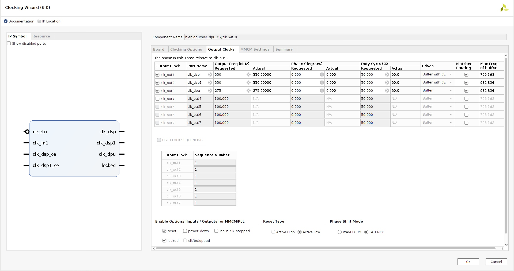

Now let's connect things up like this: 

Let's create another sheet. We're going to add a bunch of AXI interconnects between the output of our DPU and the slave interfaces we will add to our MPSoC. Technically, we don't have to add these interconnects if we made the DPU AXI interface use the same clock source as the one going into the MPSoC, but to help with timing and clock tree distribution, we will add these interconnects.

Buckle up, this one is kinda tedious. 

Let's create a 2:1 axi interconnect, and then 5 1:1 axi interconnects.

Connect all of the slave clocks and crossbar clocks together. Connect all of the cross bar resets together. Connect all of the slave resets together. Connect all of the master clocks together, and connect all of the master resets together.


Then, create an interface pin with the VLNV	set to xilinx.com:interface:aximm_rtl:1.0 as a SLAVE

We'll make a few of these:
DPU0_DATA0
DPU0_DATA1
DPU1_DATA0
DPU1_DATA1
DPU0_INSTR
DPU1_INSTR
SFM
DPU0_INSTR
DPU1_INSTR

Then some regular input pins. DPU_CLK, DPU_PERI_RSTn, DPU_INTC_RSTn, MPSoC_CLK, and MPSoC_RSTn. 

Connect the DPU_CLK up to the slave/crossbar clocks. Connect the DPU_PERI_RSTn to the slave resets. The DPU_INTC_RSTn to the crossbar reset. The MPSoC_CLK and MPSoC_RSTn to the master clock and resets respectively.

Connect each of the DPUX_DATAX interfaces, to one of the 1:1 interconnects. Also, connect the SFM interface to the remaining 1:1 interface. 

Connect the two DPUX_INSTR to the two interfaces on the 2:1 interconnect.

Now create master interface pins called HP0_FPD, HP1_FPD, HP2_FPD, HP3_FPD, LPD, and HPC0_FPD. We will use the HP0_FPD to HP3_FPD interfaces as the outputs of the DPUX_DATAX interconnects. LPD will be the output of the 2:1 INSTR interconnect. Finally, we'll use the HPC0_FPD as the output of the SFM interconnect. 

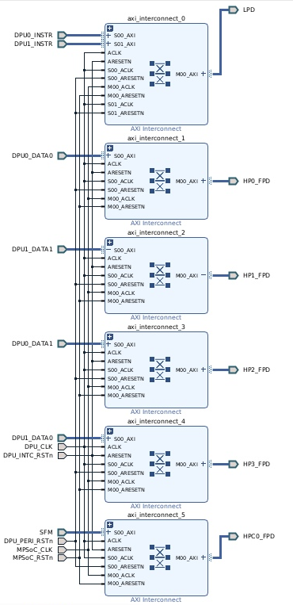

Let's pin up the dpu to the interconnect block. Then, let's create more interface pins for the output of the interconnects. Then we'll add two pins with a BASE_CLK and BASE_RSTn. We'll connect the DPU AXI CLK and the Clock Wizards CLK to this BASE_CLK. Similarly with the BASE_RSTn. 

Finally, the last interface pin for the input to the DPU, called DPU. We're almost done here, we just need to pin out the interrupts. Let's just go ahead and pin them up. 

When we're done, we should be left with this: 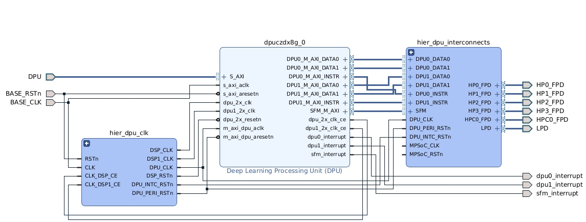

Let's start connecting the DPU up. 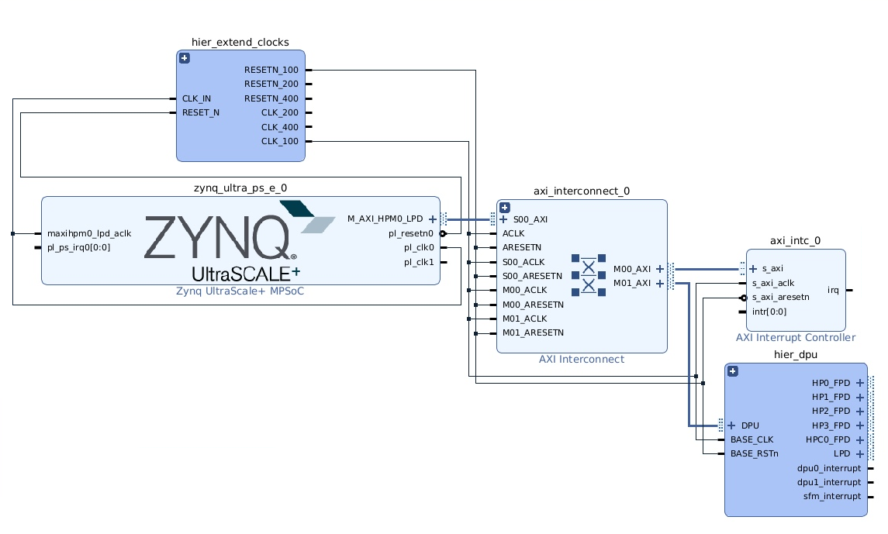

The input clocks are the same as the master axi interface and the same can be said about the reset. 

Let's head into the MPSoC IP and enable the required AXI interfaces. Head into the slave interface tab in PS-PL configuration, and enable the AXI interfaces on the output of the DPU. 

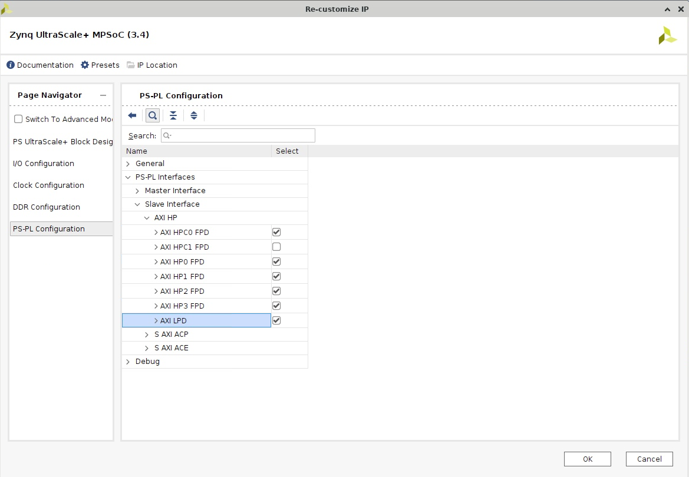

Let's pin this all up. 

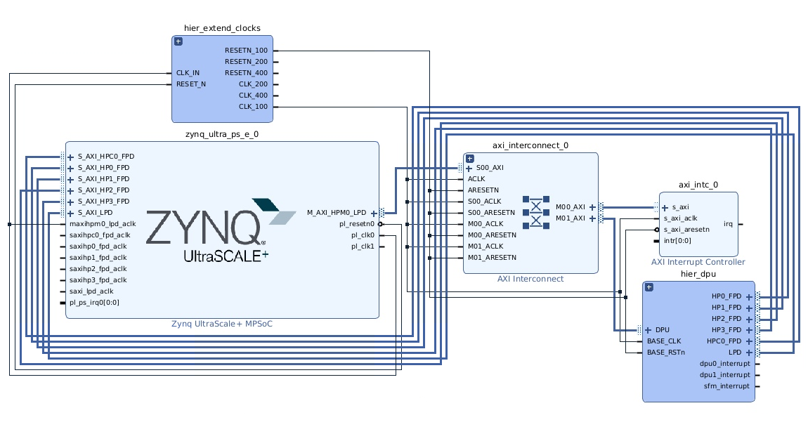

*The picture above has a mistake where pl_clk0 is connected the maxihpm0_lpd_aclk. Please connect the CLK100 from our clock wizard to the maxhipm0_lpd_aclk*

We're missing one small thing. We need to add pins for the MPSoC CLK and Resets. Let's go back into the DPU hierarchy and create pins for that, and connect it up to the interconnects.

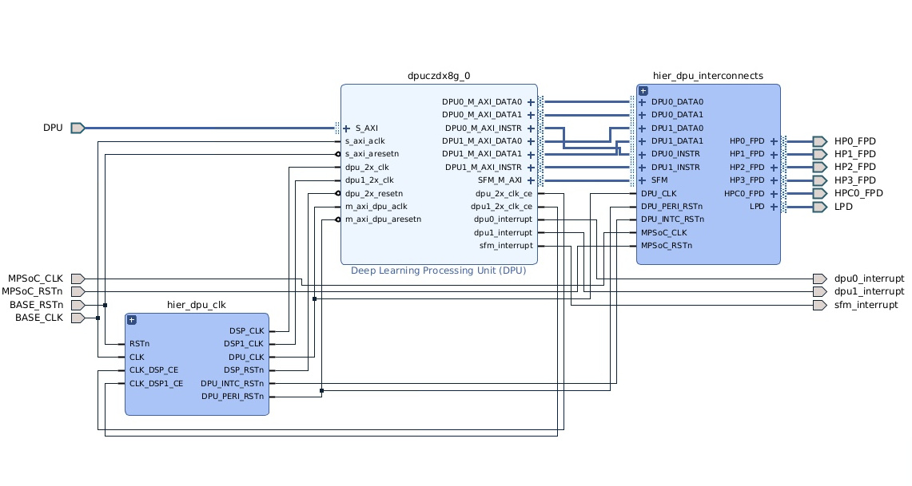

Next, we'll need to add a processor reset for the 275 clock coming out of pl_clk1. Let's go ahead and add that. Same deal as before with the other processor resets. Hopefully, you're getting the hang of this by now. Let's also connect up the 275 clock to all of the slave interface clocks on the mpsoc. 

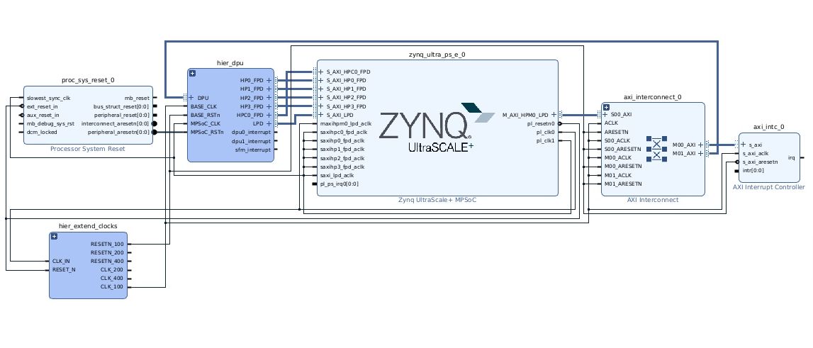

Let's now add a concat block so we can bus together the 4 interrupt sources we have. Connect the three interrupts from the DPU and the interrupt controller we added to the ps_lk_irq0[0:0] pin on the MPSoC. Don't worry that the width is different, this will be fixed when validate the design.

Speaking of which, let's validate the design!

If you get an error like this, do not fret!
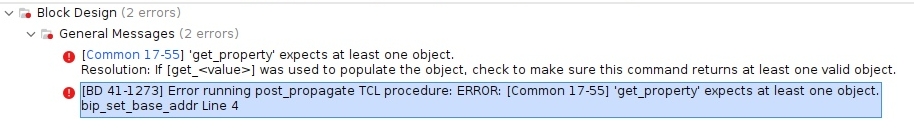


Head over the Address Editor tab, and you'll see one of the DPU interfaces is excluded by default for some reason. Right click on the interface, include it, and then assign it.

The only things remaining should be about how you can change the reset source for a pin on the DPU and for an unconnected interrupt pin. We can ignore these.

This is what the final diagram should look like: 
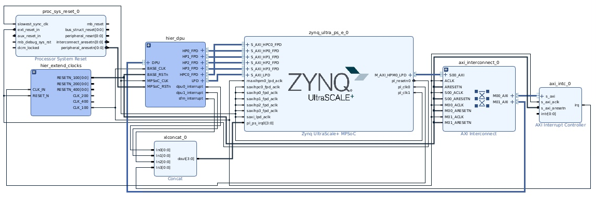

We now have to go through the same process of setting up the peripherals in the other kr260_regular_platform_setup.md

Some things of note, you'll have less full power AXI interfaces available. Just enable all the ones you do have. You probably will have fewer master interfaces available, just enable M02-M08. 

To close it all out, go ahead and export a wrapper for the block design. Export the platform, etc. etc. These steps can again be found in the kr260_regular_platform_setup.md

Feel free to make any changes as you see fit. For example changing the architecture of the DPU and the number of DPUs.

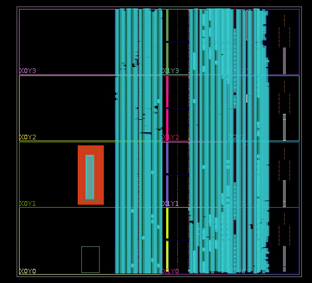

My suspicion is there isn't much more space on the FPGA to increase the DPU count or the architecture, but feel free to play around with this for your needs. The 2x DPU/B512 architecture is just for demonstration.

### Petalinux

We're going to follow very similar steps as before. After running petalinux-config for the first time with the new `.xsa`. Go ahead and run 

```console
user@eceXXX:/scratch/<workspace>/kr260_petalinux_os$ petalinux-config -c kernel
```

and then we want to enable the DPU package. If you set up your DPU previosuly correctly, this should now be able.

```console
Device Drivers ---> Misc devices ---> Xilinux Deep learning Processing Unit (DPU) Driver [*] (enable)
```

Then, when you go to enable your packages, please also enable `xauth`. Use the search feature in the menu to navigate to it. 

Head over to: https://github.com/Xilinx/Vitis-AI/tree/3.0/dpu and download the reference design for the KR260.

We want to copy: recipes-apps, recipes-vitis-ai, and then copy/merge recipes-kernel from DPUCZDX8G_VAI_v3.0/prj/Vivado/sw/meta-vitis/ into <petalinux-os>/project-spec/meta-user

Update “/project-spec/meta-user/conf/petalinuxbsp.conf” with,
```console
IMAGE_INSTALL:append = " vitis-ai-library "
IMAGE_INSTALL:append = " vitis-ai-library-dev "
```

Update “/project-spec/meta-user/conf/user-rootfs.conf” with,

```console
CONFIG_vitis-ai-library
CONFIG_vitis-ai-library-dev
CONFIG_vitis-ai-library-dbg
CONFIG_dnf
CONFIG_nfs-utils
```

Then continue as before preparing the SD card. We'll need three things. In your petalinux folder, search for a `*.bit.bin` file. It should be `<block diagram name>_wrapper_bit.bin`. Copy that to your host. And like before, we'll need the pl.dtbo file, and then, create a file called `shell.json` with the contents
```
{
  "shell_type" : "XRT_FLAT",
  "num_slots": "1"
}
```

On your FPGA, create a folder called kr260_dpu in /lib/firmware/xilinx/. Copy over the three files mentioned above into that folder.

```console
sudo xmutil listapps
sudo xmutil unloadapp
sudo xmutil loadapp kr260-dpu
```

Finally, run 
```console
sudo show_dpu
```

```
"DPU Arch":"DPUCZDX8G_ISAX_BXXX_0101000056010400" // Yours won't look exactly like this, this was from a single DPU test
```

Make note of the arch/fingerprint it prints out, as we'll need this to compile models for our DPU configuration. We'll need the `DPUCZDX8G_ISAX_BXXX` and `0101000056010400` in the future. 