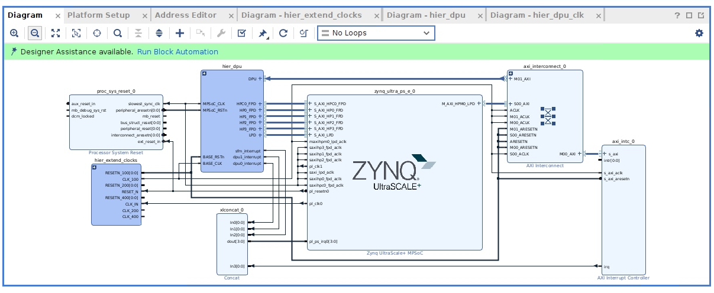

This tutorial assumes you've setup an extensible Vitis platform before. If not, please start by going through the kr260_regular_platform_setup.md tutorial as that will be more in depth.

Head over to https://github.com/Xilinx/Vitis-AI/tree/3.0/dpu and grab the IP-only version of the DPUCZDX8G IP (this is the one for Kria K26).

Let's startup Vivado, and create a project for the KR260. Make sure to set it up as an extensible Vitis platform, and make the appropriate connections for the carrier board.

We need to add the IP for the DPU into Vivado. Launch the settings window, go to IP, then Repository, and select the top level folder with the downloaded IP.

Let's create a new block diagram, and add in the Zynq MPSoC. In the PS-PL interfaces tab, we want to enable one of the low power master interfaces. For now, let's leave the slave interfaces disabled, we'll come back to this later and enable the ones that we need. This depends on the number of DPU cores we choose to instantiate.

In the PL fabric clocks tab, we want to enable a second clock. Let's set this to be a `275 MHz` clock. We'll be using this for DPU master/MPSoC slave AXI interface.

Next step, is we're going to create the clocks that you can use with the rest of your design. This is the same thing that we did in the regular platform tutorial. However, we're going to talk advantage of hierarchies in the block diagram to make our design a bit cleaner.

Right click in the empty space and "Create Hierarchy". Give it a name, and let's populate it like this:

Let's pin this up by connecting the clock and the reset from the MPSoC. 

Then, we're going to add in a 1:2 AXI interconnect (1 slave, 2 masters). This way we can use the master low performance interface on the MPSoC talk to the DPU and to handle the interrupt requests. Let's connect all of the clocks on this interconnect (crossbar clock, slave clock, and master clocks) to the `100 Mhz` clock generated by the clocking wizard hierarchy. Connect the resets of the interconnect to the `100 Mhz` reset. 

Then, we need to add an `AXI Interrupt Controller`. Connect the slave interface to the `M00` interface on the AXI interconnect. Connect up the clock and the resets to the same 100 MHz clock and reset as the interconnect.

*Ignore the extra connections as this picture comes from later in the tutorial*

Create a hierarchy, call it `hier_dpu`. Add in the DPU ip block. Set the number of DPU cores to 2, and the arch to B512 (feel free to change this later, but you'll have to make sure your model is appropriately compiled for this architecture down the line)

Now, we need to create another hierarchy inside of the dpu for the clocks that we will need. In the clocking wizard we'll need to do a few things
- In the clocking options, make sure to set the primitive as Auto
- Create 2x 550 MHz clocks, set the drives to Buffer with CE
- Create 1x 275 MHz clocks
- Enable optional input reset pin

Now let's connect this up like:

Let's create another hierarchy. We're going to add a bunch of AXI interconnects between the output of our DPU and the slave interfaces we will add to our MPSoC. Technically, we don't have to add these interconnects if we made the DPU AXI interface use the same clock source as the one going into the MPSoC, but to help with timing and clock tree distribution, we will add these interconnects.

We'll stasrt by creating a 2:1 AXI Interconnect, and then 5 1:1 AXI Interconnects. We'll connect all of the slave and crossbar clocks together. Connect all of the slave resets together. Connect all of the master clocks together, and then finally all of the master resets together.

Then we're going to create an interface pin by right clicking in the empty space and choosing the create interface pin (ctrl+l). We'll set this direction as `slave` and set the VLNV as `xilinx.com:interface:aximm_rtl:1.0`. All of the AXI pins will be of this VLNV type, but the direction will change depending on the context.

Let's create a few of these:
- DPU0_DATA0
- DPU0_DATA1
- DPU1_DATA0
- DPU1_DATA1
- DPU0_INSTR
- DPU1_INSTR
- SFM

Then some regular input pins. DPU_CLK, DPU_PERI_RSTn, DPU_INTC_RSTn, MPSoC_CLK, and MPSoC_RSTn. 

Connect the DPU_CLK up to the slave/crossbar clocks. Connect the DPU_PERI_RSTn to the slave resets. The DPU_INTC_RSTn to the crossbar reset. The MPSoC_CLK and MPSoC_RSTn to the master clock and resets respectively.

Connect each of the DPUX_DATAX interfaces, to one of the 1:1 interconnects. Also, connect the SFM interface to the remaining 1:1 interface. 

Connect the two DPUX_INSTR to the two interfaces on the 2:1 interconnect.

Now create master interface pins called HP0_FPD, HP1_FPD, HP2_FPD, HP3_FPD, LPD, and HPC0_FPD. We will use the HP0_FPD to HP3_FPD interfaces as the outputs of the DPUX_DATAX interconnects. LPD will be the output of the 2:1 INSTR interconnect. Finally, we'll use the HPC0_FPD as the output of the SFM interconnect. 

Let's go ahead and pin all of this together like this:

Let's head into the MPSoC IP and enable the required AXI interfaces. Head into the slave interface tab in PS-PL configuration, and enable the smae AXI interfaces on the output of the DPU. 

Next, we'll need to add a processor reset for the 275 clock coming out of pl_clk1. Let's go ahead and add that. Same deal as before with the other processor resets. Hopefully, you're getting the hang of this by now. Let's also connect up the 275 clock to all of the slave interface clocks on the MPSoC. 

Let's now add a concat block so we can bus together the 4 interrupt sources we have. Connect the three interrupts from the DPU and the interrupt controller we added to the ps_lk_irq0[0:0] pin on the MPSoC. Don't worry that the width is different, this will be fixed when validate the design.

Finally, with everything pinned up, we should get something like this:

Speaking of which, let's validate the design!

If you get an error like this, do not fret!

Head over the Address Editor tab, and you'll see one of the DPU interfaces is excluded by default for some reason. Right click on the interface, include it, and then assign it.

The only things remaining should be about how you can change the reset source for a pin on the DPU and for an unconnected interrupt pin. We can ignore these.

We now have to go through the same process of setting up the peripherals in the other kr260_regular_platform_setup.md. Things like the PMU, I2C, SPI, GEM, DisplayPort, Fan, etc.

Some things of note, you'll have less full power AXI interfaces available. Just enable all the ones you do have. You probably will have fewer master interfaces available, just enable M02-M08. 

To close it all out, go ahead and export a wrapper for the block design. Export the platform, etc. etc. These steps can again be found in the kr260_regular_platform_setup.md

Feel free to make any changes as you see fit. For example changing the architecture of the DPU and the number of DPUs.

My suspicion is there isn't much more space on the FPGA to increase the DPU count or the architecture, but feel free to play around with this for your needs. The 2x DPU/B512 architecture is just for demonstration.
