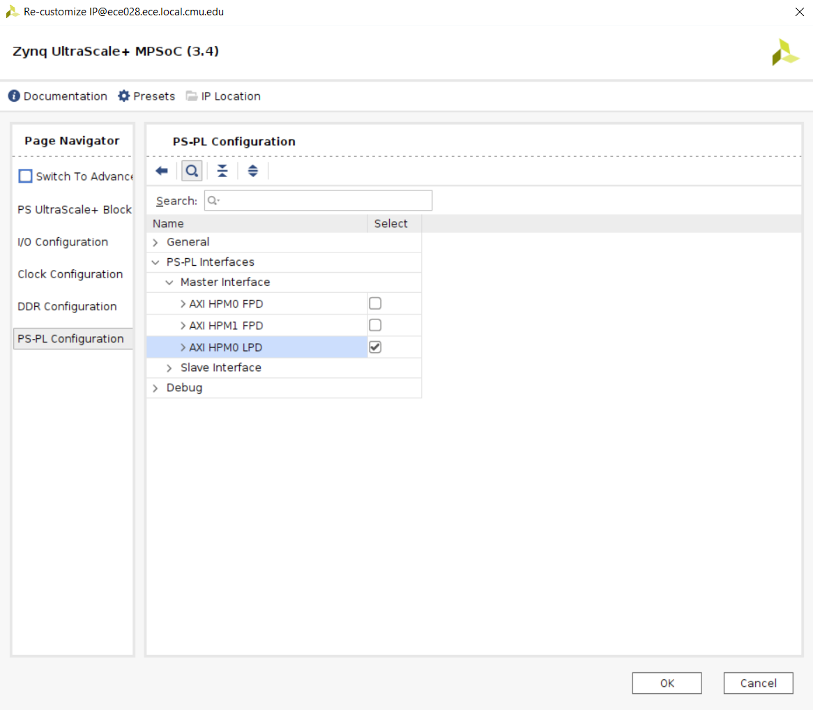

# KR260 Platform Setup

This guide serves as a starting point for setting up the hardware platform for the KRIA KR260 Robotics Starter Kit

---

## Setup

Please use the tool versions specified in these guides to ensure maximum compatability. You might run into issues with different tool versions.

The various tools we will need to use ocassionally have issues being ran in your AFS workspace. To get around this, we do our work in the `/scratch` directory on the ECE machines.

Start by SSHing into your ECE machine 

``` console
ssh <username>@eceXXX.ece.local.cmu.edu
```

Navigate to the `/scratch` directory:

``` console
user@eceXXX:~$ cd /scratch
```

Create a workspace directory and set the permissions so only you can view the contents (or setup the permissions as you see fit).

``` console
user@eceXXX:/scratch$ mkdir ece500_kr260_workspace
user@eceXXX:/scratch$ chmod 700 ece500_kr260_workspace
```

Then source the Vivado setup file and start Vivado.
``` console
user@eceXXX:/scratch$ source /afs/ece/support/xilinx/xilinx.release/Vivado-2022.2/Vivado/2022.2/settings64.sh
user@eceXXX:/scratch$ vivado &
```

## Create Vivado Project

With Vivado 2022.2 open, under the `Quick Start` menu, click on `Create Project`


Hit `Next` and go to the `Project Name` tab. Set a name for the project, specify the workspace created in the [Setup](##Setup) section, and leave the `Create Project Subdirectory` option checked.


Hit `Next` and go to the `Project Type` tab. Check the `Project is an extensible Vitis platform`.


Hit `Next` and go to the `Default Part` tab. Click the `Boards` header, and search for `KR260`. Then click on the `Connections` link that shows up under the `Kria KR260 Robotics Start Kit SOM`.

If no matches for the KR260 are found, click on the `Refresh` button near the bottom left corner of the window, and search again.


Populate the connections as shown below:


Hit `Okay` then `Next` and you should see this


Then hit `Finish`. You should now see this screen:


## HW Block Diagram

Click on the `Create Block Design` button. Make sure to save your block design ofetn. If you need to exit Vivado, you can come back to your block design by clicking the `Open Block Design` button below the `Create Block Design` button.


In the popup, give it a design name. I named mine `Design name: kr260_bd` Leave the other fields to their default, `Directory: <Local to Project>` and `Specify source set: Design Sources`. 

In the `Diagram` window, click on the plus sign, and add the `Zynq Ultrascale+ MPSoC` component. A green banner will popup, click on the link that says `Run Block Automation`. Ensure that the option for `Apply Board Preset` is checked and hit `Ok`. 

You should expect to see something like this:


Double click on the Zync UltraScale+ MPSoC IP block, then navigate to the `PS-PL Configuration` tab. Uncheck the two full power master AXI interfaces and only enable the low power master AXI interface.



Notice how now the `M_AXI_HPM0_LPD` interface is the only AXI interface on the MPSoC.

Now add a `Clocking Wizard` IP component. Double click it and navigate to the `Output Clocks` tab. Enable `clk_out1`, `clk_out2`, and `clk_out3` and set the frequencies to `100 MHz`, `200 MHz`, and `400 MHz`, respectively. 


Scroll down, to the bottom of the `Output Clocks` tab and set the `Reset Type` to `Active Low` (recall the pl_reset*n*0) on the MPSoC.  


Connect the `Clocking Wizard` to the `Zynq UltraScale+ MPSoC` by connecting `resetn` to `pl_resetn0` and `clk_in1` to `pl_clk0`. It should look like this:


You can click on the `Optimize Routing` button to make the routing look a bit cleaner.


For each of the clocks we've added, we need to add a `Processor System Reset`. Connect the `clk_outX` to each of the `slowest_sync_clk` of the reset blocks. Connect the `ext_reset_in` to the `pl_resetn0` from the MPSoC. Finally, connect the each of the `dcm_locked` to the `locked` of the `Clocking Wizard`. 

When you're done, it should look like this. 


Next, we need to add an interrupt controller. We add an `AXI Interrupt Controller`. Update the `Interrupt Output Connection` to `Single` (instead of `Bus`). 


In the green banner that pops up, click on `Run Connection Automation`. Set all of the `Clock Source for --` to the 200MHz clock created before. Double click on the `AXI Interconnect` that gets generated and take a look at its settings. Nothing has to be changed here. 

Finally, connect the `irq` of the Interrupt Controller to the `pl_ps_irq0[0:0]` pin of the MPSoC. When done, it will look like this.


Now is a good time to save your design if you haven't done so already!

Navigate to the `Platform Setup` tab, then the `AXI Port` tab, and enable all of the full power AXI interfaces available on the MPSoC. In addition, set the `SP Tag` to some short string for each of the Slave AXI ports. I've just went with the name of the AXI port.

In addition, under the `AXI Interconnect` section, enable ports `M01_AXI` to `M08_AXI`. 


Then go to the `Clock` tab, enable the 3 clocks from the `Clocking Wizard`. Set the IDs of the clock `0`, `1`, and `2`. Set the default clock to 200MHz.


Then, in the `Interrupt` tab, enable `intr` under the `AXI Interrupt Controller` section.


