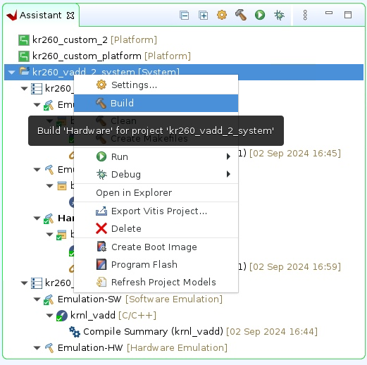

# KR260 Vitis Example Adder

This guide will walk you through how to setup a sample Vitis project.

## Platform Setup

Head over to your workspace, and create this directory structure

```
<workspace>/
├─ kr260_vitis_platform/
│  ├─ pfm/
│  │  ├─ boot/
│  │  │  ├─ bl31.elf
│  │  │  ├─ pmufw.elf
│  │  │  ├─ system.dtb
│  │  │  ├─ u-boot.elf
│  │  │  ├─ zynqmp_fsbl.elf
│  │  ├─ sd_dir/
```

The files in the boot directory should be copied from your `<workspace>/kr260_petalinux_os/images/linux` directory.

Then, we need to source Petalinux again and install the SDK into our platform

```console
user@eceXXX:/scratch/<workspace>$ source PetaLinux/2022.2/settings.sh
user@eceXXX:/scratch/<workspace>/kr260_petalinux_os/images/linux$ ./sdk.sh -d ../../../kr260_vitis_platform
```

Next, we need to generate the Device Tree Overlay. Start by sourcing Vitis, and launching `XSCT` (Xilinx Software Command line Tool)

```console
user@eceXXX:/scratch/<workspace>/kr260_vitis_platform$ source /afs/ece/support/xilinx/xilinx.release/Vivado-2022.2/Vitis/2022.2/settings64.sh
user@eceXXX:/scratch/<workspace>/kr260_vitis_platform$ xsct

xsct%: hsi::open_hw_design <path to platform xsa>
xsct%: createdts -hw <path to platform xsa> -zocl -platform-name kria_kr260 -git-branch xlnx_rel_v2022.2 -overlay -compile -out ./dtg_output
xsct% exit

user@eceXXX:/scratch/<workspace>/kr260_vitis_platform$ cd dtg_output/dtg_output/kria_kr260/psu_cortexa53_0/device_tree_domain/bsp
user@eceXXX:/scratch/<workspace>/kr260_vitis_platform/dtg_output/dtg_output/kria_kr260/psu_cortexa53_0/device_tree_domain/bsp$ dtc -@ -O dtb -o pl.dtbo pl.dtsi
```

## Vitis Platform

For the rest of this tutorial **Please use FastX (or an XFCE client equivalent) Vitis does not correctly work when X11 forwarded.**

Head over to your workspace, source and launch Vitis

```console
user@eceXXX:/scratch/<workspace>$ source /afs/ece/support/xilinx/xilinx.release/Vivado-2022.2/Vitis/2022.2/settings64.sh
user@eceXXX:/scratch/<workspace>$ vitis &
```

Once Vitis is open, set `kr260_vitis_platfrom` as your workspace directory.

We'll start by first creating a new `Platform Project`. I named my project as `kr260_custom_platform`. Hit `Next` and then choose the tab that says `Create a new platform from hardware (XSA)`. Then choose the `.xsa` file we've been using for all of the previous steps. Ensure that the OS is set to linux, process is psu_cortexa53, and architecture is 64-bit. At the bottom, make sure to uncheck `Generate boot components` since we manually did that above. 

Once the Platform project generates, the platform.spr file will open automatically. Navigate to `kr260_custom_platform/psu_cortexa53/linux on psu_cortexa53`.


Use the drop down menu next to the Bif file line and select the option to `Generate Bif`.

Then set Boot Components Directory to the boot directory created in earlier steps, `pfm/boot`.

Set FAT32 Partition Directory to the sd_dir directory created in earlier steps, `pfm/sd_dir`.

Finally, build the Platform Project by right-clicking on its name in the Explorer window and selecting the option to Build Project.


## Vitis Project

With the Platform Project complete, select New/Application Project to create the application project. Select the Platform Project as the target platform for the application. Name the project, what you want. I called mine `kr260_example_add`.

Hit `Next` and then set the `Sysroot path` to be `<workspace>/kr260_vitis_platform/sysroots/cortexa72-cortexa53-xilinx-linux`. Then set the `Root FS` path to be the `rootfs.ext4` found in the `<petalinux>/images/linux/` directory. Then set the `Kernel Image` to the file called `Image` in the same `<petalinux>/images/linux/` directory.

Hit `Next`, and in the templates, choose the Vector Addition template. Take some time and look through the template code and try to understand what all is going on. Note that this uses HLS to generate the Vector Addition Kernel.

In the `Explorer` tab, open up the top level `.sprj` file, the one that isn't in any of the folders. Make sure that the `Active build configuration` is set to `Hardware`.


In the `Assistant` tab, right click on the `_system` line and build it.



We're going to need to copy over a few files to the FPGA so that we can run the program. Boot up your FPGA with the PetaLinux image, connect it to your computer and set an IP address again for it.

We'll need to copy over the `kr260_example_add/Hardware/kr260_example_add` file, the `pl.dtbo` file, `kr260_example_add_system_hw_link/Hardware/binary_container_1.xclbin`.

Then, create a file called `shell.json` with the contents
```
{
  "shell_type" : "XRT_FLAT",
  "num_slots": "1"
}
```

Copy over these 4 files to the FPGA. On the FPGA, create a directory called `/lib/firmware/xilinx/kr260_example_add`, then copy over the `.dtbo`, `.xclbin`, `shell.json` file, and the `kr260_example_add` file, into the created folder. You will also need to rename the `.xclbin` file to end with `.bin` to make sure it get's properly recognized.

Then run
```console
sudo xmutil listapps

# You should see the kr260_example_add as one of the available apps

sudo xmutil unloadapp
sudo xmutil loadapp kr260_example_add
sudo chmod +x kr260_example_add
./kr260_example_add binary_container_1.bin
```


